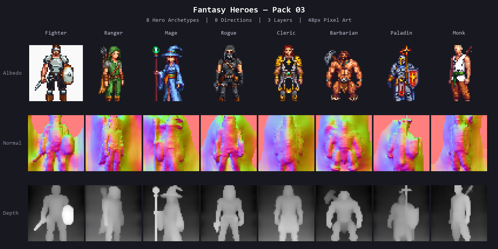
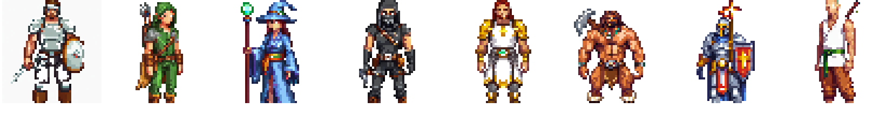

<p align="center">
  <a href="README.ja.md">日本語</a> | <a href="README.zh.md">中文</a> | <a href="README.es.md">Español</a> | <a href="README.fr.md">Français</a> | <a href="README.hi.md">हिन्दी</a> | <a href="README.it.md">Italiano</a> | <a href="README.md">English</a>
</p>

<p align="center">
  
</p>

<p align="center">
  <a href="https://github.com/mcp-tool-shop-org/fantasy-heroes-sprite-pack/actions"></a>
  <a href="https://www.npmjs.com/package/@sprite-foundry/fantasy-heroes-48"></a>
  <a href="https://github.com/mcp-tool-shop-org/fantasy-heroes-sprite-pack/blob/main/LICENSE"></a>
  <a href="https://mcp-tool-shop-org.github.io/fantasy-heroes-sprite-pack/"></a>
</p>

Um pacote de heróis em pixel art de 48px, com 8 direções, incluindo mapas de albedo, normal e profundidade, para uso em jogos compatíveis com diferentes engines.



## O que está incluído

8 arquétipos de heróis que formam um grupo completo de aventureiros:



| Variação | Função | Silhueta |
|---------|------|------------|
| Guerreiro | Combatente versátil | Espada + escudo, armadura equilibrada |
| Arqueiro | Atacante à distância | Arco, capa, silhueta mais leve |
| Mago | Conjurar | Cajado, túnica, silhueta mágica |
| Ladino | Flanqueador | Capuz, armadura leve, adagas, postura ágil |
| Clérigo | Curador/Suporte | Porrete com flanges, escudo com emblema solar, vestes |
| Bárbaro | Dano alto | Arma grande, corpo superior largo, massa de pele/couro |
| Paladino | Tanque de elite | Armadura completa, escudo de pavilhão, machado de guerra, capa |
| Monge | Especialista rápido | Sem armadura, faixas, cajado, silhueta disciplinada |

Cada variação é fornecida com três camadas de mapa:

- **Albedo** — sprites de cor base (PNG transparente)
- **Normal** — mapas normais para iluminação dinâmica
- **Profundidade** — mapas de profundidade para efeitos de paralaxe e elevação

## Instalação

```bash
npm install @sprite-foundry/fantasy-heroes-48
```

## Estrutura de Pastas

```
assets/
  fighter/
    albedo/    8 directional PNGs (front, front_left, left, back_left, back, back_right, right, front_right)
    normal/    8 matching normal maps
    depth/     8 matching depth maps
    preview/   contact sheet
    manifest.json
  ranger/
  mage/
  rogue/
  cleric/
  barbarian/
  paladin/
  monk/
pack.json          pack-level index
previews/          banner and lineup sheets
```

## Formato do Manifesto

Cada variação possui um arquivo `manifest.json`:

```json
{
  "slug": "fighter",
  "name": "Fighter",
  "version": "1.0.0",
  "tileSize": 48,
  "directions": ["front", "front_left", "left", "back_left", "back", "back_right", "right", "front_right"],
  "layers": {
    "albedo": "albedo/{direction}.png",
    "normal": "normal/{direction}.png",
    "depth": "depth/{direction}.png"
  },
  "preview": "preview/contact_sheet.png"
}
```

O arquivo `pack.json` de nível do pacote indexa todas as variações com os caminhos para cada manifesto.

## Compatibilidade com Engines

Estes são arquivos PNG simples com metadados JSON. Eles funcionam com qualquer engine ou framework que possa carregar imagens:

- Phaser
- PixiJS
- Godot
- RPG Maker
- Unity (2D)
- Engines personalizadas

Não requer formato específico de engine ou dependência de runtime.

## Especificações

- **Tamanho do tile:** 48 x 48 px
- **Direções:** 8 (frente, frente_esquerda, esquerda, trás_esquerda, trás, trás_direita, direita, frente_direita)
- **Formato:** PNG transparente
- **Mapas:** albedo + normal + profundidade
- **Animação:** poses estáticas (v1)
- **Perspectiva:** visão superior

## Expandindo o Pacote

Deseja gerar variações adicionais de heróis que correspondam ao estilo artístico e ao contrato de exportação deste pacote?

Este pacote foi criado com [Sprite Foundry](https://github.com/mcp-tool-shop-org/sprite-foundry), um pipeline de geração de pixel art open-source ComfyUI + SDXL. O repositório do foundry contém tudo o que você precisa:

- **Pipeline de geração** — `pipeline/foundry_gen.py` controla o ComfyUI com configurações específicas para cada personagem
- **Configurações de personagens** — `pipeline/chars/hero_*.json` definem os prompts exatos, sementes, regras de silhueta e condições de rejeição para cada variação neste pacote
- **Manifesto em lote** — `pipeline/manifests/fantasy_heroes_03.json` mapeia todas as 8 configurações para a estrutura de exportação
- **CLI de exportação** — `foundry export <run_id>` produz pacotes determinísticos com checksums
- **Ajuste do ControlNet** — intensidade da profundidade humanoide 0.60, end% 0.85 (documentado no manifesto)

Para adicionar uma nova variação:

1. Crie uma configuração de personagem em `pipeline/chars/` seguindo as configurações de herói existentes
2. Registre: `python -m foundry.cli subject-add <id> --name "Nome"`
3. Gere: `python -m pipeline.foundry_gen --config pipeline/chars/<config>.json`
4. Revise, aceite, gere os mapas, aceite a finalização, exporte
5. Copie o pacote exportado para o diretório correspondente `assets/<slug>/`

O [README do Sprite Foundry](https://github.com/mcp-tool-shop-org/sprite-foundry#readme) contém o guia completo do pipeline.

## Segurança

Este pacote contém **apenas imagens PNG estáticas e metadados JSON**. Não há código executável, nem scripts de instalação, nem acesso à rede e nem coleta de dados de uso. Os recursos são de apenas leitura por design.

Consulte o arquivo [SECURITY.md](SECURITY.md) para a política de segurança completa.

## Licença

MIT — pode ser usado em projetos comerciais e não comerciais.

## Créditos

Gerado com [Sprite Foundry](https://github.com/mcp-tool-shop-org/sprite-foundry) usando o pipeline de arte em pixels ComfyUI + SDXL.

Desenvolvido por <a href="https://mcp-tool-shop.github.io/">MCP Tool Shop</a
