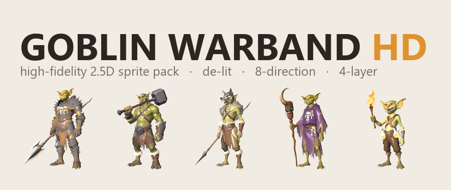
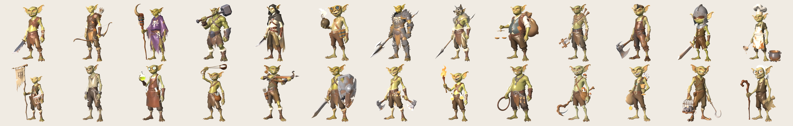

<p align="center">
  
</p>

<p align="center">
  <a href="https://www.npmjs.com/package/@sprite-foundry/goblin-warband-hd"></a>
  <a href="https://github.com/mcp-tool-shop-org/sprite-foundry-packs/blob/main/packages/goblin-warband-hd/LICENSE"></a>
</p>

**26 high-fidelity 2.5D goblins — de-lit, engine-relightable, 8-direction.** The HD companion to [`@sprite-foundry/goblin-warband-48`](https://www.npmjs.com/package/@sprite-foundry/goblin-warband-48): the original warband **expanded to 26** (the 16 from the 48px pack plus 10 HD-exclusive archetypes), rebuilt at illustration fidelity for games that light their sprites at runtime (HD-2D / 2.5D). A full camp, not just a combat line — fighters, support, and quest-flavor NPCs.



## Why de-lit?

These sprites carry **form and material; your engine supplies the light.** That is the HD-2D contract (Octopath Traveler, Sea of Stars): a placed light casts real shadows, the normal map turns a flat billboard into volume, the mask's ambient-occlusion deepens the folds and its roughness lets iron catch a highlight the leather doesn't. The same goblin reads correctly at noon, at dusk, and in a torch-lit cave — from one pack.

## What's Included

26 goblin archetypes, each with **8 directional views × 4 map layers** at **512×512**, foot-anchored (pivot `[0.5, 1.0]`):

| Variant | Role | Identity cue |
|---------|------|--------------|
| Grunt | Melee fodder | Green skin, big ears, leather scraps, jagged dagger |
| Archer | Ranged skirmisher | Patched leather, short bow, quiver |
| Shaman | Caster / healer | Purple robe, bone fetishes, horned totem staff |
| Brute | Heavy melee tank | Bare muscled chest, tusks, massive club |
| Scout | Fast flanker | Dark hooded cloak, dagger |
| Bomber | AoE threat | Brass goggles, lit bomb, explosives satchel |
| Warchief | Elite leader | Spiked iron armor, skull trophies, war-spear |
| Wolf-Rider | Mounted unit | Wolf-pelt leathers, wolf-skull helm, spear |
| Merchant | Camp trader | Patched vest, loot sack, balance scale |
| Trap Maker | Ambush engineer | Coils of rope + net, stakes, wooden trap |
| Tunneler | Cave specialist | Headlamp, pickaxe, grimy work leathers |
| Pup | Young goblin | Oversized helmet, little wooden sword |
| Cook | Camp cook | Stained apron, tall cook's hat, ladle |
| Banner Bearer | War standard carrier | Ragged war-banner, war-drum |
| Prisoner | Chained captive | Tattered rags, broken shackles |
| Alchemist | Volatile potion brewer | Leather apron, goggles, vial bandolier |
| Slinger | Ranged skirmisher | Whirling leather sling, stone pouch |
| Crossbowman | Mechanical ranged | Crude repeating crossbow, bolt case |
| Shieldbearer | Defensive tank | Huge scrap shield, short stabbing sword |
| Duelist | Melee specialist | Twin hand-axes, scars, trophy belt |
| Firebrand | Arsonist | Blazing torch, oil-flask bandolier |
| Slaver | Cruel overseer | Coiled whip, ring of keys + chains |
| Spore-Tender | Forager / support | Glowing-mushroom satchel, gathering hook |
| Cutpurse | Thief | Stolen coin-purse, lockpicks, jeweled goblet |
| Ratcatcher | Vermin handler | Rusty caged rats, hooked prod |
| Elder | Warband loremaster | White hair, cracked spectacles, cane, scroll |

### The four layers

| Layer | What it is | Use it for |
|---|---|---|
| **albedo** | de-lit base colour — **no baked light, shadow, or AO** | the sprite; your engine lights it |
| **normal** | view-space surface normals — OpenGL-style (Y up), blue ≈ toward camera (flip green for DirectX) | real-time directional lighting |
| **mask** | **R = ambient occlusion · G = roughness · B = emissive** | contact shadows, material sheen, self-glow |
| **depth** | linear camera-distance (white = near) | parallax / tooling (not 2D lighting) |

Every layer is pixel-aligned across the 8 directions; each goblin ships a `manifest.json` (`schema_version 2.0.0`) with a per-file SHA-256, the pivot, the mask channel map, and per-engine notes.

## Install

```bash
npm install @sprite-foundry/goblin-warband-hd
```

## Folder Structure

```
assets/
  grunt/
    albedo/    8 directional PNGs (front, front_left, left, back_left, back, back_right, right, front_right)
    normal/    8 matching view-space normal maps
    mask/      8 matching AO/roughness/emissive masks
    depth/     8 matching depth maps
    manifest.json
  ...15 more
```

## Engine Compatibility

Plain PNG + JSON — load them anywhere, then wire the layers into your lighting pipeline:

- **Godot 4** — `albedo` on a `Sprite2D`, `normal` via `CanvasTexture.normal_texture`, a `PointLight2D`; sample `mask.g` for specular, `mask.r` to modulate ambient.
- **Unity URP (2D)** — `albedo` → `_BaseMap`, `normal` → `_NormalMap`, `mask` → `_MaskMap` (R=AO, G=roughness).
- **Phaser / PixiJS / custom** — `albedo` + `normal` into the 2D lighting pipeline; `mask` / `depth` are tooling-side.

`manifest.json` carries the per-engine notes in `engineNotes`. No engine-specific format, no runtime dependency.

## The `-hd` line vs the `48` line

`goblin-warband-48` (retro 48px pixel-art) and `goblin-warband-hd` are **parallel tiers, not a breaking upgrade.** The HD tier carries all 16 of the 48px warband **plus 10 HD-exclusive archetypes (26 total)**, same direction order and foot-anchored framing — ship the 48px pack for a pixel game, ship `-hd` for a high-fidelity 2.5D game. Pick the tier your renderer wants.

## Specs

- **Variants:** 26 goblin archetypes (16 from the 48px line + 10 HD-exclusive)
- **Tile size:** 512 × 512 px
- **Directions:** 8
- **Layers:** albedo + normal + mask (AO/roughness/emissive) + depth
- **Total sprites:** 832 (26 × 8 × 4)
- **Format:** transparent PNG + `manifest.json` (schema 2.0.0)
- **Pivot:** `[0.5, 1.0]` (foot-anchored)

## How it's made (and why it's commercial-clean)

Each goblin starts as a fresh high-fidelity concept in a house-trained painterly style (**Qwen-Image**, Apache-2.0). The 8 directional views are generated **without a 3D mesh** — **Qwen-Image-Edit-2511** (Apache-2.0) rotates the camera around the character while holding identity, so the face and detail survive every angle. Each view is then decomposed into its 2.5D layers by single-image estimators: a de-lit albedo + roughness from **Marigold-IID** (Apache-2.0 code, OpenRAIL weights — commercial-OK), real surface normals from **Marigold-Normals**, depth from **Depth-Anything-V2-Base** (Apache-2.0), a clean alpha matte from **BiRefNet** (MIT), and ambient occlusion derived from the depth — then packed to the contract above. The original `goblin-warband-48` silhouette, palette, and signature prop are preserved per goblin. Identity stays in the image model — **no InsightFace / InstantID / face-adapter weights** (which carry non-commercial licenses) touch this pack. Every component is Apache-2.0 / MIT / commercial-OpenRAIL; the assets are yours to ship.

## Security

This package contains **only static PNG images and JSON metadata** — no executable code, no install hooks, no network access, no telemetry. See [SECURITY.md](SECURITY.md).

## License

MIT — use in commercial and non-commercial projects.

## Credits

Built by <a href="https://mcp-tool-shop.github.io/">MCP Tool Shop</a> with the [Sprite Foundry](https://github.com/mcp-tool-shop-org/sprite-foundry) no-mesh 2.5D pipeline (Qwen-Image + Qwen-Image-Edit + Marigold + Depth-Anything-V2).
