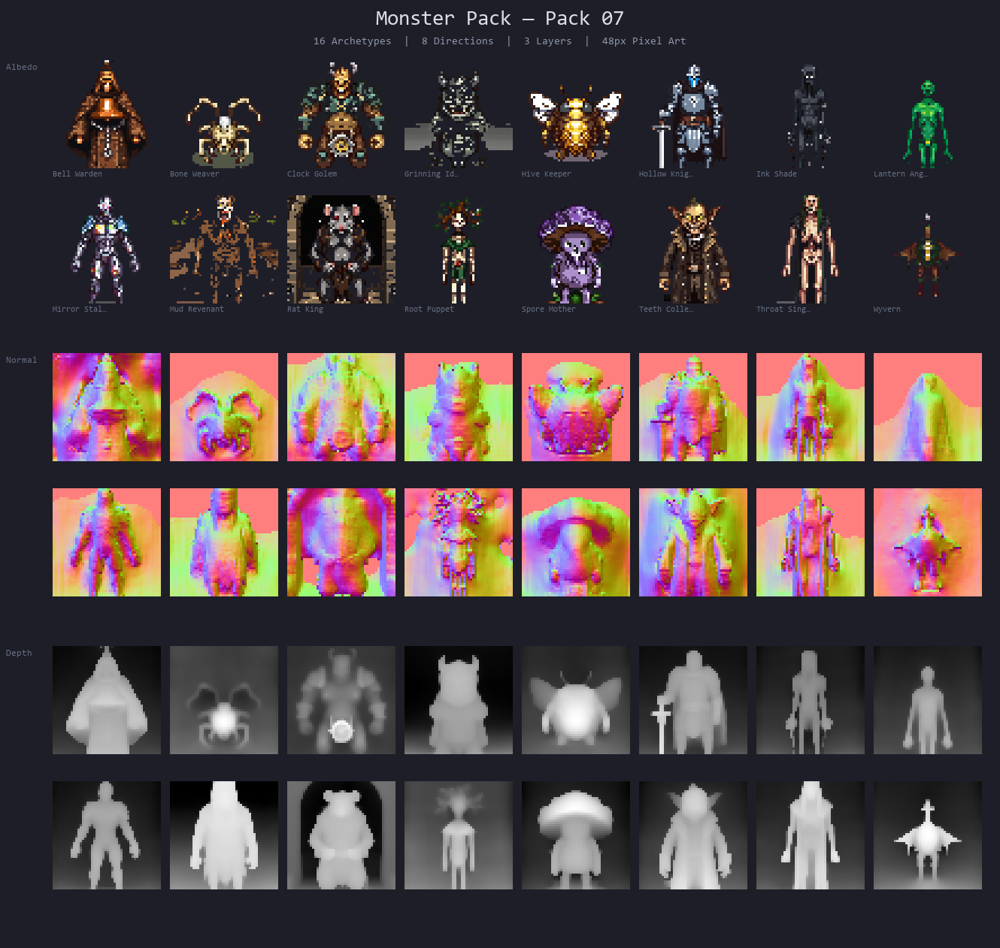
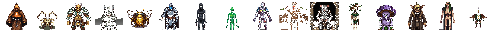

<p align="center">
  <a href="README.md">English</a> | <a href="README.zh.md">中文</a> | <a href="README.es.md">Español</a> | <a href="README.fr.md">Français</a> | <a href="README.hi.md">हिन्दी</a> | <a href="README.it.md">Italiano</a> | <a href="README.pt-BR.md">Português (BR)</a>
</p>

<p align="center">
  
</p>

<p align="center">
  <a href="https://www.npmjs.com/package/@sprite-foundry/monster-pack-48"></a>
  <a href="https://github.com/mcp-tool-shop-org/sprite-foundry-packs/blob/main/packages/monster-pack-48/LICENSE"></a>
</p>

48pxのピクセルアートモンスターの素材集。アルベド、ノーマルマップ、深度マップが含まれており、ゲームエンジンに依存しない形で利用可能です。



## 内容

6種類のモンスターのバリエーションを合計16種類収録しています。



### ヒューマノイド

| バリエーション | 役割 | シルエット |
|---------|------|------------|
| ベルウォーデン | 範囲攻撃/エリア封鎖 | 重いベルと鎖を持つローブ姿。銅色の色合い。 |
| ホロウナイト | 近接戦闘のエリート | 空の鎧、剣、髑髏の紋章 |
| 歯収集者 | 盗賊/スカベンジャー | ゴブリンのような外見、大きな歯、長いコート |

### 背が高く細身

| バリエーション | 役割 | シルエット |
|---------|------|------------|
| インクシェード | ステルス/暗殺者 | 暗く細長い姿、インクのような液体が滴る |
| ランタンアンラー | 誘い/待ち伏せ型モンスター | 発光する誘引器官、半透明の皮膚、針のような歯 |
| ミラーストーカー | 反射/カウンター | 反射面、水晶の破片、鋭い爪 |
| ルートパペット | 寄生/支配 | 寄生植物の根によって動かされた死体、木の根のような脚 |
| スロートシンガー | 音波/集団制御 | 骸骨、肋骨が露出している、黒いローブ |

### 幅広く短く

| バリエーション | 役割 | シルエット |
|---------|------|------------|
| クロックゴーレム | 重装タンク | 機械仕掛けの構造物、歯車状の胴体、重い四肢 |
| スマイリングアイドル | 環境ハザード | アニメーションする石のトーテム、笑顔の彫刻、苔むした表面 |
| ハイブキーパー | 群れを召喚する | 巨大な昆虫型、キチン質の装甲、複眼 |

### 不定形

| バリエーション | 役割 | シルエット |
|---------|------|------------|
| マッドリヴェナント | ゆっくりとした追跡 | 粘土のような姿、燃えるような目、埋葬用の布 |
| ラットキング | 群れボス | 融合したネズミの塊、絡み合った尾、多くの目 |
| スポアマザー | 広範囲攻撃/デバフ | 菌類の塊、キノコの傘のような王冠、胞子の雲 |

### 昆虫型

| バリエーション | 役割 | シルエット |
|---------|------|------------|
| ボーンウィーバー | 罠/待ち伏せ | 盗んだ骨で作られたクモ、頭蓋骨 |

### 翼を持つ

| バリエーション | 役割 | シルエット |
|---------|------|------------|
| ワイバーン | 飛行ボス | 二足歩行のドラゴン、コウモリのような翼、棘のある尾 |

各バリエーションには、以下の3つのマップレイヤーが含まれています。

- **アルベド (Albedo)**：基本色スプライト（透明PNG）
- **ノーマル (Normal)**：動的なライティングのためのノーマルマップ
- **深度 (Depth)**：パララックス効果と高低差効果のための深度マップ

## インストール

```bash
npm install @sprite-foundry/monster-pack-48
```

## フォルダ構造

```
assets/
  bell_warden/
    albedo/    8 directional PNGs (front, front_left, left, back_left, back, back_right, right, front_right)
    normal/    8 matching normal maps
    depth/     8 matching depth maps
    preview/   contact sheet
    manifest.json
  bone_weaver/
  clock_golem/
  ...
pack.json          pack-level index (includes bodyClass per variant)
previews/          banner and lineup sheets
```

## マニフェスト形式

各バリエーションには、`manifest.json`ファイルがあります。

```json
{
  "slug": "rat_king",
  "name": "Rat King",
  "version": "1.0.0",
  "tileSize": 48,
  "directions": ["front", "front_left", "left", "back_left", "back", "back_right", "right", "front_right"],
  "layers": {
    "albedo": "albedo/{direction}.png",
    "normal": "normal/{direction}.png",
    "depth": "depth/{direction}.png"
  },
  "preview": "preview/contact_sheet.png"
}
```

パック全体の`pack.json`ファイルは、各バリエーションのパスと、`bodyClass`のメタデータを記述しています。

## ゲームエンジンとの互換性

これらは、JSONメタデータを含むプレーンなPNGファイルです。画像を読み込むことができるすべてのゲームエンジンまたはフレームワークで使用できます。

- Phaser
- PixiJS
- Godot
- RPG Maker
- Unity (2D)
- カスタムエンジン

特定のエンジン形式や実行時依存関係はありません。

## 仕様

- **バリエーション:** 16種類のモンスター
- **ボディクラス:** 6種類 (ヒューマノイド、背が高く細身、幅広く短く、不定形、昆虫型、翼を持つ)
- **タイルサイズ:** 48 x 48 px
- **方向:** 8方向 (正面、左正面、左、左背面、背面、右背面、右、右正面)
- **合計スプライト数:** 384 (16 x 8 x 3)
- **形式:** 透明PNG
- **マップ:** アルベド + ノーマル + 深度
- **アニメーション:** 静止ポーズ (v1)
- **視点:** トップダウン

## 拡張パックについて

このパックのスタイルとエクスポート設定に合わせた、追加のモンスターバリエーションを生成したいですか？

このパックは、[Sprite Foundry](https://github.com/mcp-tool-shop-org/sprite-foundry)という、オープンソースのComfyUI + SDXLによるピクセルアート生成パイプラインを使用して作成されました。 人型以外のモンスターは、**モンスター専用の処理**を使用します。これは、特定の体の形状に合わせたControlNetの深度マップで、人間の骨格を強制することなく、多様な体の構造を表現できます。 Foundryのリポジトリには、必要なものがすべて含まれています。

- **生成パイプライン**: `pipeline/foundry_gen.py` が、各オブジェクトごとの設定でComfyUIを制御します。
- **オブジェクト設定**: `pipeline/chars/beast_*.json` に、このパックに含まれるすべてのバリエーションの詳細なプロンプト、シード値、および体の種類が定義されています。
- **深度マップ生成器**: `pipeline/morph_refs/gen_amorphous_depth.py`, `gen_wide_squat_depth.py`, `gen_tall_thin_depth.py`
- **体の種類のプリセット**: 各クリーチャーの種類に応じて、ControlNetの強度とタイミングを自動的に選択します。
- **エクスポートCLI**: `foundry export <run_id>` を使用すると、チェックサム付きの安定したパックを生成できます。

新しいバリエーションを追加するには：

1. `pipeline/chars/` に、既存のモンスター設定を参考に、新しいオブジェクト設定を作成します。
2. 登録: `python -m foundry.cli subject-add <id> --name "名前"`
3. 生成: `python -m pipeline.foundry_gen --config pipeline/chars/<設定ファイル名>.json`
4. 確認し、承認し、マップを生成し、完了を承認し、エクスポートします。
5. エクスポートされたパックを、対応する `assets/<スラッグ>/` ディレクトリにコピーします。

[Sprite FoundryのREADME](https://github.com/mcp-tool-shop-org/sprite-foundry#readme) には、パイプライン全体の詳しい手順が記載されています。

## セキュリティ

このパッケージには、**静的なPNG画像とJSONメタデータのみ**が含まれています。 実行可能なコード、インストールスクリプト、ネットワークアクセス、およびテレメトリー機能はありません。 アセットは、設計上、読み取り専用です。

セキュリティポリシーの詳細については、[SECURITY.md](SECURITY.md) を参照してください。

## ライセンス

MITライセンス：商用および非商用プロジェクトでの利用が可能です。

## クレジット

[Sprite Foundry](https://github.com/mcp-tool-shop-org/sprite-foundry) を使用して、ComfyUI + SDXLピクセルアートパイプラインで生成されました。

制作：<a href="https://mcp-tool-shop.github.io/">MCP Tool Shop</a>
