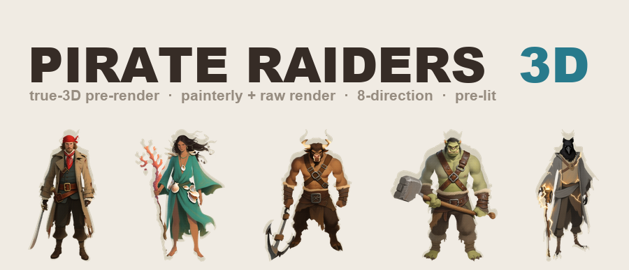
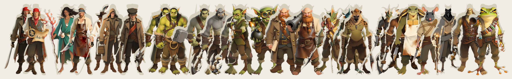

<p align="center">
  
</p>

<p align="center">
  <a href="https://www.npmjs.com/package/@sprite-foundry/pirate-raiders-3d"></a>
  <a href="https://github.com/mcp-tool-shop-org/sprite-foundry-packs/blob/main/packages/pirate-raiders-3d/LICENSE"></a>
</p>

**26 fantasy-pirate raiders, pre-rendered from true 3D meshes — 8 directions, two finished looks, perfect all-angle consistency.** Each raider is a real 3D model photographed from eight fixed camera angles, so a held cutlass, a coiled rope, a minotaur's horns, and a turtle's shell are **the same object in every direction** — they never drift, flip, or re-imagine themselves from view to view. A **multi-species free-port raider crew** for the fantasy seas: a human captain commanding orcs, ogres, a sea-troll, goblins, dwarves, and a deep roster of rarer folk — lizardfolk, sahuagin, gnoll, dragonborn, minotaur, tortle, ratfolk, kenku, half-giant, and grung. **16 species — 7 human, 19 non-human.**



## Why pre-rendered 3D?

Image-only turnaround tools have to **re-invent** every angle of a sprite from the front view, and that is where held props, profiles, and backs quietly drift apart. This pack skips the guesswork: each raider is a genuine 3D mesh, and the eight directional frames are **camera angles on one model.** The silhouette is consistent, the weapon is the same weapon from the back as from the front, and the faces hold. You get the painted look of 2.5D with the rotational integrity of 3D — without shipping a single polygon to your engine.

Two finished looks ship for every frame, and they are **pre-lit** (the light is baked into the art) — drop them onto an unshaded billboard and they read immediately, no lighting setup required.

## What's Included

26 crew archetypes across 16 species, each with **8 directional views × 2 looks** at **768×768**, foot-anchored (pivot `[0.5, 1.0]`), on transparent alpha:

| Variant | Species | Role | Identity cue |
|---------|---------|------|--------------|
| Captain | human | fleet commander | Sea-coat, bandana, wide buckled belt |
| Navigator | human | charts & helm | Bandana, astrolabe, rolled sea-chart |
| Sea-Witch | human | sea-magic caster | Sea-green robes, shells, coral staff |
| Sawbones | human | ship surgeon | Blood-stained apron, surgical saw |
| Swashbuckler | human | duelist | Open shirt, sash, feathered hat, rapier |
| Smuggler | human | fence / contraband | Hooded coat, many pockets, sash |
| Cabin Kid | human | deckhand | Oversized coat, flat cap, sash |
| First Mate | orc | enforcer | Tusks, officer's sea-coat, boarding axe |
| Harpooner | orc | ranged hunter | Tusks, bare arms, barbed harpoon, rope |
| Bosun | ogre | deck discipline | Huge, harness straps, belaying maul |
| Berserker | ogre | boarding bruiser | Bare scarred chest, anchor on a chain |
| Breaker | sea-troll | siege brute | Warty grey-green hide, anchor-club |
| Marksman | goblin | crossbow sniper | Green skin, brass eyepiece, crossbow |
| Bombardier | goblin | sea-bombs | Goggles, lit sea-bomb, explosive satchel |
| Quartermaster | dwarf | supplies & coin | Braided beard, ledger, hand-cannon |
| Cannoneer | dwarf | deck guns | Braided beard, apron, deck-cannon |
| Diver | lizardfolk | pearl-hunter | Scaled crest, tail, nets, barbed spear |
| Tide-Cultist | sahuagin | kraken priest | Fins, scales, barnacled robes, idol-staff |
| Reaver | gnoll | frenzied boarder | Hyena head, mane, twin axes |
| Marine | dragonborn | armored boarder | Scaled, horned, naval armor, pike + shield |
| Juggernaut | minotaur | anchor tank | Bull head, horns, ship's anchor |
| Cook | tortle | galley & cleaver | Turtle shell, beak, apron, cleaver |
| Rigger | ratfolk | topman / ropes | Rat head, whiskers, long tail, rope |
| Stormcaller | kenku | storm-magic | Crow head, feathers, lightning rod |
| Brig-Keeper | half-giant | jailer | Towering, leather jerkin, keys + chain |
| Poisoner | grung | dart & toxin | Bright frog-folk, blowgun, toxin vials |

### The two looks

| Look | What it is | Use it for |
|---|---|---|
| **painterly** | the studio's hand-painted house style — a finished concept-art finish over the render | the hero sprite; a stylized 2.5D RPG |
| **render** | the raw 3D render — a clean, neutral matte "3D-game" look | a crisper/cooler aesthetic, or as a base for your own treatment |

Both looks are **pixel-aligned** across all 8 directions and between each other, so you can swap or cross-fade them freely. Each raider ships a `manifest.json` (`schema_version 2.0.0`) with a per-file SHA-256, the pivot, and per-engine notes.

## Install

```bash
npm install @sprite-foundry/pirate-raiders-3d
```

## Folder Structure

```
assets/
  captain/
    painterly/   8 directional PNGs (front, front_left, left, back_left, back, back_right, right, front_right)
    render/      8 matching raw-render PNGs
    manifest.json
  ...25 more
```

## Engine Compatibility

Plain transparent PNG + JSON — load them anywhere. Because the art is **pre-lit**, use an **unshaded / unlit** material; do not add a normal map.

- **Godot 4** — `painterly` (or `render`) on a `Sprite2D`, or as a billboarded `Sprite3D` with an unshaded `StandardMaterial3D`; depth-sort by the pivot. Swap the directional frame from your facing angle.
- **Unity (2D / URP)** — a **Sprite-Unlit** material with `_BaseMap` = the chosen look; flip frames per facing.
- **Phaser / PixiJS / custom** — drop the PNG in as a sprite frame; pick the painterly or render look per project.

`manifest.json` carries the per-engine notes in `engineNotes`. No engine-specific format, no runtime dependency.

## The `-3d` line vs `-hd` vs `48`

Three parallel tiers of the same fantasy raider crew, **same 26 archetypes**, different production and contract:

- **`pirate-raiders-48`** — retro 48px pixel art, for a pixel game.
- **`pirate-raiders-hd`** — high-fidelity 2.5D, **de-lit** (albedo + normal + mask + depth), for engines that **light the sprite at runtime**.
- **`pirate-raiders-3d`** — true-3D pre-rendered, **pre-lit** (painterly + raw render), for **all-angle rotational consistency** and a drop-in finished look.

Pick `-hd` if you want to control the lighting yourself; pick `-3d` if you want a rotation-true sprite that already looks finished. Pick the tier your renderer wants.

## Specs

- **Variants:** 26 crew archetypes across 16 species (7 human / 19 non-human)
- **Tile size:** 768 × 768 px
- **Directions:** 8 (`front, front_left, left, back_left, back, back_right, right, front_right`)
- **Looks:** painterly + render (both pre-lit, transparent)
- **Total sprites:** 416 (26 × 8 × 2)
- **Format:** transparent PNG + `manifest.json` (schema 2.0.0)
- **Pivot:** `[0.5, 1.0]` (foot-anchored)

## How it's made (and why it's commercial-clean)

Each raider starts as a fresh high-fidelity concept in a house-trained painterly style (**Qwen-Image**, Apache-2.0). That concept is lifted into a textured 3D mesh by **TRELLIS.2** (MIT), then **rendered from 8 fixed camera angles** in Blender (Cycles / OptiX, transparent alpha, OpenImageDenoise) — this is the `render` look. Each frame is then finished into the house painterly style by an image pass — **Qwen-Image** with the **InstantX Qwen-Image-ControlNet-Union** (Apache-2.0) holding the silhouette via Canny, plus the studio style LoRA — giving the `painterly` look while the ControlNet keeps it locked to the true 3D silhouette. No 3D geometry ships; you get pre-rendered 2.5D sprites. Every component is MIT / Apache-2.0; the assets are yours to ship in commercial and non-commercial projects.

## Security

This package contains **only static PNG images and JSON metadata** — no executable code, no install hooks, no network access, no telemetry. See [SECURITY.md](SECURITY.md).

## License

MIT — use in commercial and non-commercial projects.

## Credits

Built by <a href="https://mcp-tool-shop.github.io/">MCP Tool Shop</a> with the [Sprite Foundry](https://github.com/mcp-tool-shop-org/sprite-foundry) 3D pre-render pipeline (Qwen-Image + TRELLIS.2 + Blender + InstantX ControlNet).
