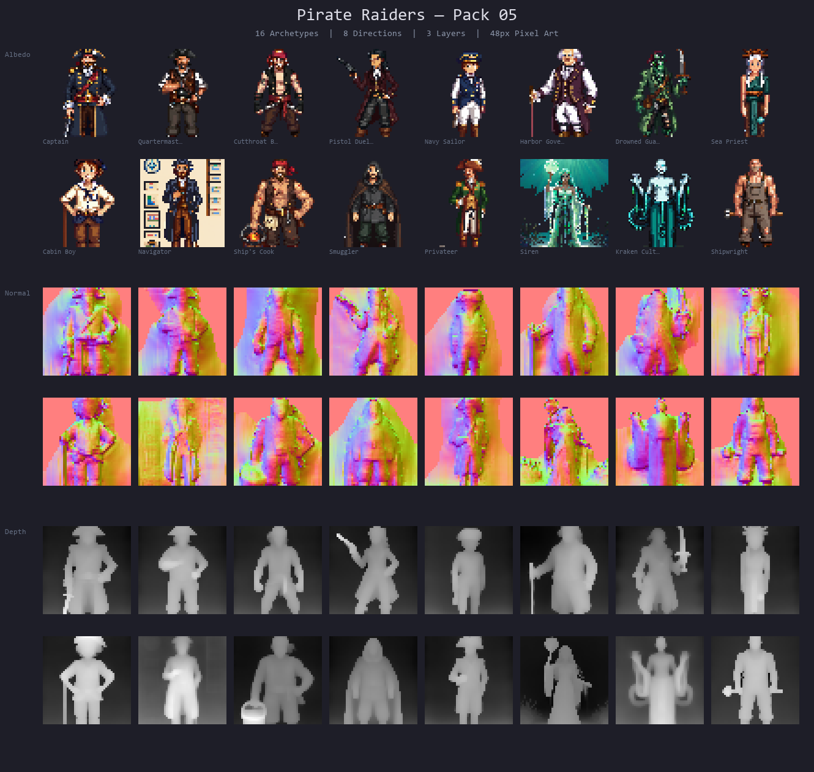
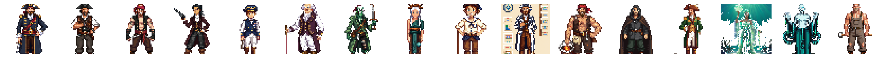

<p align="center">
  <a href="README.ja.md">日本語</a> | <a href="README.zh.md">中文</a> | <a href="README.es.md">Español</a> | <a href="README.fr.md">Français</a> | <a href="README.hi.md">हिन्दी</a> | <a href="README.it.md">Italiano</a> | <a href="README.pt-BR.md">Português (BR)</a>
</p>

<p align="center">
  
</p>

<p align="center">
  <a href="https://github.com/mcp-tool-shop-org/pirate-raiders-sprite-pack/actions"></a>
  <a href="https://www.npmjs.com/package/@sprite-foundry/pirate-raiders-48"></a>
  <a href="https://github.com/mcp-tool-shop-org/pirate-raiders-sprite-pack/blob/main/LICENSE"></a>
  <a href="https://mcp-tool-shop-org.github.io/pirate-raiders-sprite-pack/"></a>
</p>

A 48px, 8-direction pixel-art pack of maritime characters with albedo, normal, and depth maps for engine-agnostic game use. **Pack 05** in the [Sprite Foundry](https://github.com/mcp-tool-shop-org/sprite-foundry) catalog.



## What's Included

16 pirate archetypes across two tiers — **Officers and Authority** and **The Crew** — each with 8 directional views:



### Officers and Authority (original 8)

| Variant | Role | Silhouette |
|---------|------|------------|
| Captain | Commander | Tricorn hat, navy coat with gold trim, ornate cutlass at hip |
| Quartermaster | Logistics / discipline | Wide-brim leather hat, stocky build, arms crossed, key ring on belt |
| Cutthroat Boarder | Melee assault | Red bandana, sleeveless jerkin, twin curved boarding cutlasses |
| Pistol Duelist | Ranged specialist | Fitted burgundy long coat, flintlock pistol, ammunition bandolier |
| Navy Sailor | Military authority | Blue-white uniform, bicorne hat, crossbelts, clean military posture |
| Harbor Governor | Civilian authority | Plum formal coat, powdered wig, portly build, walking cane |
| Drowned Guardian | Undead maritime | Waterlogged green skin, tattered coat, rusted iron chestplate, barnacles |
| Sea Priest | Mystic / support | Coral-branch headdress, teal layered robe, barnacle censer on chain |

### The Crew — Working Hands and Port Life (v1.1)

| Variant | Role | Silhouette |
|---------|------|------------|
| Cabin Boy | Young deckhand | Tiny frame, oversized hat, mop, gap-toothed grin |
| Navigator | Chart reader | Spyglass extended, rolled charts, wire spectacles |
| Ship's Cook | Galley master | Stocky build, cleaver on shoulder, stained apron, bandana |
| Smuggler | Hidden cargo runner | Hooded cloak pulled closed, shifty stance, gold tooth |
| Privateer | Licensed pirate | Cavalier hat, rapier, sealed letter, refined but dangerous |
| Siren | Oceanic enchantress | Flowing teal hair, shell crown, glowing enchantment |
| Kraken Cultist | Deep-sea zealot | Shaved head with tentacle tattoos, ritual dagger, mad eyes |
| Shipwright | Ship builder | Muscular, carpenter's hammer, wooden planks, tool belt |

Each variant ships with three map layers:

- **Albedo** — base color sprites (transparent PNG)
- **Normal** — normal maps for dynamic lighting
- **Depth** — depth maps for parallax and elevation effects

## Install

```bash
npm install @sprite-foundry/pirate-raiders-48
```

## Folder Structure

```
assets/
  captain/
    albedo/    8 directional PNGs (front, front_left, left, back_left, back, back_right, right, front_right)
    normal/    8 matching normal maps
    depth/     8 matching depth maps
    preview/   contact sheet
    manifest.json
  quartermaster/
  cutthroat/
  pistoleer/
  navy-sailor/
  governor/
  drowned/
  sea-priest/
  cabin-boy/
  navigator/
  ships-cook/
  smuggler/
  privateer/
  siren/
  kraken-cultist/
  shipwright/
pack.json          pack-level index
previews/          banner and lineup sheets
```

## Manifest Format

Each variant has a `manifest.json`:

```json
{
  "slug": "captain",
  "name": "Captain",
  "version": "1.0.0",
  "tileSize": 48,
  "directions": ["front", "front_left", "left", "back_left", "back", "back_right", "right", "front_right"],
  "layers": {
    "albedo": "albedo/{direction}.png",
    "normal": "normal/{direction}.png",
    "depth": "depth/{direction}.png"
  },
  "preview": "preview/contact_sheet.png"
}
```

The pack-level `pack.json` indexes all variants with paths to each manifest.

## Engine Compatibility

These are plain PNG files with JSON metadata. They work with any engine or framework that can load images:

- Phaser
- PixiJS
- Godot
- RPG Maker
- Unity (2D)
- Custom engines

No engine-specific format or runtime dependency.

## Specs

- **Variants:** 16 pirate archetypes (8 Officers + 8 Crew)
- **Tile size:** 48 x 48 px
- **Directions:** 8 (front, front_left, left, back_left, back, back_right, right, front_right)
- **Total sprites:** 384 (16 × 8 × 3)
- **Format:** transparent PNG
- **Maps:** albedo + normal + depth
- **Animation:** static poses (v1)
- **Perspective:** top-down

## Extending the Pack

Want to generate additional pirate variants that match this pack's art style and export contract?

This pack was produced with [Sprite Foundry](https://github.com/mcp-tool-shop-org/sprite-foundry), an open-source ComfyUI + SDXL pixel-art generation pipeline. The foundry repo contains everything you need:

- **Generation pipeline** — `pipeline/foundry_gen.py` drives ComfyUI with per-subject configs
- **Subject configs** — `pipeline/chars/pirate_*.json` define the exact prompts, seeds, silhouette rules, and reject conditions for every variant in this pack
- **Batch manifest** — `pipeline/manifests/pirate_raiders_05.json` maps all 16 configs to the export structure
- **Export CLI** — `foundry export <run_id>` produces deterministic packs with checksums
- **ControlNet tuning** — humanoid depth strength 0.60, end% 0.85 (documented in the manifest)

To add a new variant:

1. Create a subject config in `pipeline/chars/` following the existing pirate configs
2. Register: `python -m foundry.cli subject-add <id> --name "Name"`
3. Generate: `python -m pipeline.foundry_gen --config pipeline/chars/<config>.json`
4. Review, accept, produce maps, accept finish, export
5. Copy the exported pack into the matching `assets/<slug>/` directory

The [Sprite Foundry README](https://github.com/mcp-tool-shop-org/sprite-foundry#readme) has the full pipeline walkthrough.

## Security

This package contains **only static PNG images and JSON metadata**. There is no executable code, no install hooks, no network access, and no telemetry. Assets are read-only by design.

See [SECURITY.md](SECURITY.md) for the full security policy.

## License

MIT — use in commercial and non-commercial projects.

## Credits

Generated with [Sprite Foundry](https://github.com/mcp-tool-shop-org/sprite-foundry) using ComfyUI + SDXL pixel-art pipeline.

Built by <a href="https://mcp-tool-shop.github.io/">MCP Tool Shop</a>
