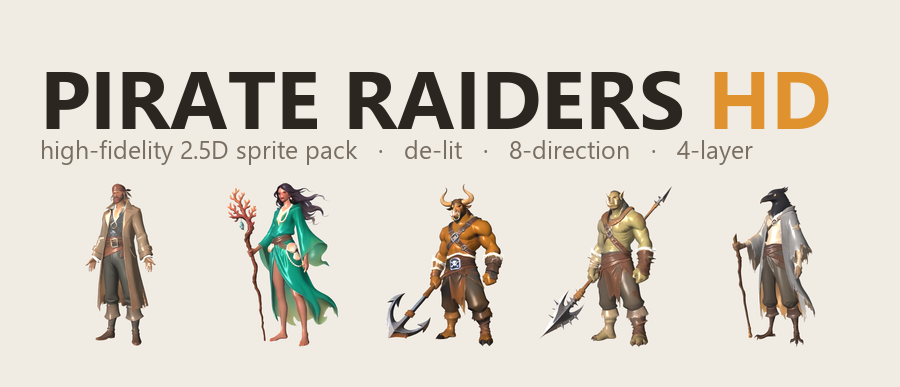
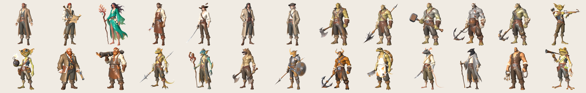

<p align="center">
  
</p>

<p align="center">
  <a href="https://www.npmjs.com/package/@sprite-foundry/pirate-raiders-hd"></a>
  <a href="https://github.com/mcp-tool-shop-org/sprite-foundry-packs/blob/main/packages/pirate-raiders-hd/LICENSE"></a>
</p>

**26 high-fidelity 2.5D fantasy-pirate raiders — de-lit, engine-relightable, 8-direction.** A **multi-species free-port raider crew** for the fantasy seas — *not* tricorne-and-parrot cosplay. Weathered, dangerous, lived-in: a human captain commanding orcs, ogres, a sea-troll, goblins, dwarves, and a deep roster of rarer folk — lizardfolk, sahuagin, gnoll, dragonborn, minotaur, tortle, ratfolk, kenku, half-giant, and grung. **15 species, 7 human / 19 non-human.** The HD line's fantasy reimagining of the pirate theme, built at illustration fidelity for games that light their sprites at runtime (HD-2D / 2.5D).



## Why de-lit?

These sprites carry **form and material; your engine supplies the light.** That is the HD-2D contract (Octopath Traveler, Sea of Stars): a placed light casts real shadows, the normal map turns a flat billboard into volume, the mask's ambient-occlusion deepens the folds and its roughness lets a steel cutlass catch a highlight the coat doesn't. The same raider reads correctly on a sunlit deck, at dusk, and in a lantern-lit hold — from one pack.

## What's Included

26 crew archetypes across 15 species, each with **8 directional views × 4 map layers** at **512×512**, foot-anchored (pivot `[0.5, 1.0]`):

| Variant | Species | Role | Identity cue |
|---------|---------|------|--------------|
| Captain | human | fleet commander | Sea-coat, bandana, wide buckled belt |
| Navigator | human | charts & helm | Bandana, astrolabe, rolled sea-chart |
| Sea-Witch | human | sea-magic caster | Sea-green robes, shells, coral staff |
| Sawbones | human | ship surgeon | Blood-stained apron, surgical saw |
| Swashbuckler | human | duelist | Open shirt, sash, feathered hat, rapier |
| Smuggler | human | fence / contraband | Hooded coat, many pockets, sash |
| Cabin Kid | human | deckhand | Oversized coat, flat cap, sash |
| First Mate | orc | enforcer | Tusks, officer's sea-coat, boarding axe |
| Harpooner | orc | ranged hunter | Tusks, bare arms, barbed harpoon, rope |
| Bosun | ogre | deck discipline | Huge, harness straps, belaying maul |
| Berserker | ogre | boarding bruiser | Bare scarred chest, anchor on a chain |
| Breaker | sea-troll | siege brute | Warty grey-green hide, anchor-club |
| Marksman | goblin | crossbow sniper | Green skin, brass eyepiece, crossbow |
| Bombardier | goblin | sea-bombs | Goggles, lit sea-bomb, explosive satchel |
| Quartermaster | dwarf | supplies & coin | Braided beard, ledger, hand-cannon |
| Cannoneer | dwarf | deck guns | Braided beard, apron, deck-cannon |
| Diver | lizardfolk | pearl-hunter | Scaled crest, tail, nets, barbed spear |
| Tide-Cultist | sahuagin | kraken priest | Fins, scales, barnacled robes, idol-staff |
| Reaver | gnoll | frenzied boarder | Hyena head, mane, twin axes |
| Marine | dragonborn | armored boarder | Scaled, horned, naval armor, pike + shield |
| Juggernaut | minotaur | anchor tank | Bull head, horns, ship's anchor |
| Cook | tortle | galley & cleaver | Turtle shell, beak, apron, cleaver |
| Rigger | ratfolk | topman / ropes | Rat head, whiskers, long tail, rope |
| Stormcaller | kenku | storm-magic | Crow head, feathers, lightning rod |
| Brig-Keeper | half-giant | jailer | Towering, leather jerkin, keys + chain |
| Poisoner | grung | dart & toxin | Bright frog-folk, blowgun, toxin vials |

### The four layers

| Layer | What it is | Use it for |
|---|---|---|
| **albedo** | de-lit base colour — **no baked light, shadow, or AO** | the sprite; your engine lights it |
| **normal** | view-space surface normals — OpenGL-style (Y up), blue ≈ toward camera (flip green for DirectX) | real-time directional lighting |
| **mask** | **R = ambient occlusion · G = roughness · B = emissive** | contact shadows, material sheen, self-glow |
| **depth** | linear camera-distance (white = near) | parallax / tooling (not 2D lighting) |

Every layer is pixel-aligned across the 8 directions; each raider ships a `manifest.json` (`schema_version 2.0.0`) with a per-file SHA-256, the pivot, the mask channel map, and per-engine notes.

## Install

```bash
npm install @sprite-foundry/pirate-raiders-hd
```

## Folder Structure

```
assets/
  captain/
    albedo/    8 directional PNGs (front, front_left, left, back_left, back, back_right, right, front_right)
    normal/    8 matching view-space normal maps
    mask/      8 matching AO/roughness/emissive masks
    depth/     8 matching depth maps
    manifest.json
  ...25 more
```

## Engine Compatibility

Plain PNG + JSON — load them anywhere, then wire the layers into your lighting pipeline:

- **Godot 4** — `albedo` on a `Sprite2D`, `normal` via `CanvasTexture.normal_texture`, a `PointLight2D`; sample `mask.g` for specular, `mask.r` to modulate ambient.
- **Unity URP (2D)** — `albedo` → `_BaseMap`, `normal` → `_NormalMap`, `mask` → `_MaskMap` (R=AO, G=roughness).
- **Phaser / PixiJS / custom** — `albedo` + `normal` into the 2D lighting pipeline; `mask` / `depth` are tooling-side.

`manifest.json` carries the per-engine notes in `engineNotes`. No engine-specific format, no runtime dependency.

## The `-hd` line vs the `48` line

`pirate-raiders-48` (retro 48px pixel-art) and `pirate-raiders-hd` are **parallel tiers.** The HD tier is a **fantasy multi-species reimagining** — 26 raiders across 15 species — built at illustration fidelity for 2.5D lighting, rather than a 1:1 HD copy of the 48px crew. Ship the 48px pack for a retro pixel game, ship `-hd` for a high-fidelity 2.5D fantasy raider crew. Pick the tier your renderer wants.

## Specs

- **Variants:** 26 crew archetypes across 15 species (7 human / 19 non-human)
- **Tile size:** 512 × 512 px
- **Directions:** 8
- **Layers:** albedo + normal + mask (AO/roughness/emissive) + depth
- **Total sprites:** 832 (26 × 8 × 4)
- **Format:** transparent PNG + `manifest.json` (schema 2.0.0)
- **Pivot:** `[0.5, 1.0]` (foot-anchored)

## How it's made (and why it's commercial-clean)

Each raider starts as a fresh high-fidelity concept in a house-trained painterly style (**Qwen-Image**, Apache-2.0). The 8 directional views are generated **without a 3D mesh** — **Qwen-Image-Edit-2511** (Apache-2.0) rotates the camera around the character while holding identity, so faces, scales, shells, and tails survive every angle. Each view is then decomposed into its 2.5D layers by single-image estimators: a de-lit albedo + roughness from **Marigold-IID** (Apache-2.0 code, OpenRAIL weights — commercial-OK), real surface normals from **Marigold-Normals**, depth from **Depth-Anything-V2-Base** (Apache-2.0), a clean alpha matte from **BiRefNet** (MIT), and ambient occlusion derived from the depth — then packed to the contract above. Identity stays in the image model — **no InsightFace / InstantID / face-adapter weights** (which carry non-commercial licenses) touch this pack. Every component is Apache-2.0 / MIT / commercial-OpenRAIL; the assets are yours to ship.

## Security

This package contains **only static PNG images and JSON metadata** — no executable code, no install hooks, no network access, no telemetry. See [SECURITY.md](SECURITY.md).

## License

MIT — use in commercial and non-commercial projects.

## Credits

Built by <a href="https://mcp-tool-shop.github.io/">MCP Tool Shop</a> with the [Sprite Foundry](https://github.com/mcp-tool-shop-org/sprite-foundry) no-mesh 2.5D pipeline (Qwen-Image + Qwen-Image-Edit + Marigold + Depth-Anything-V2).
