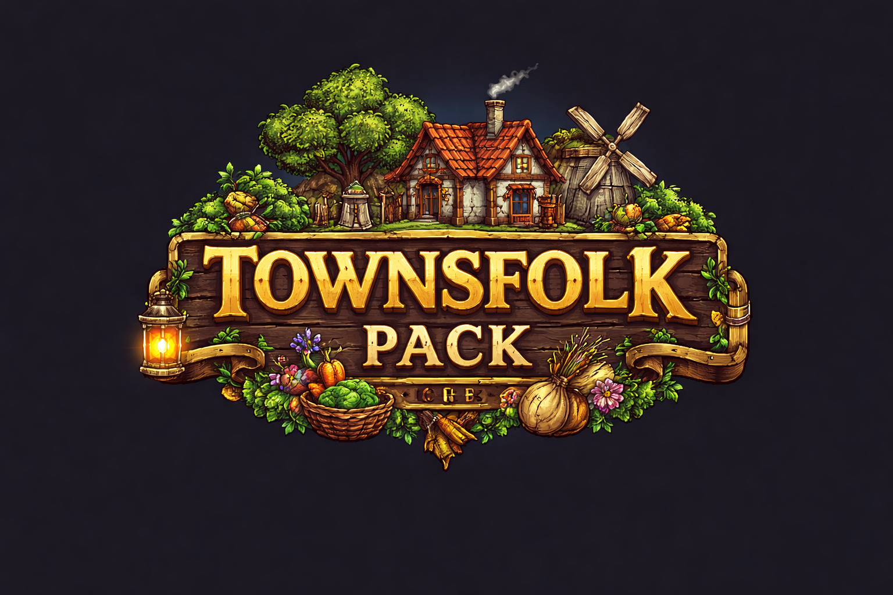
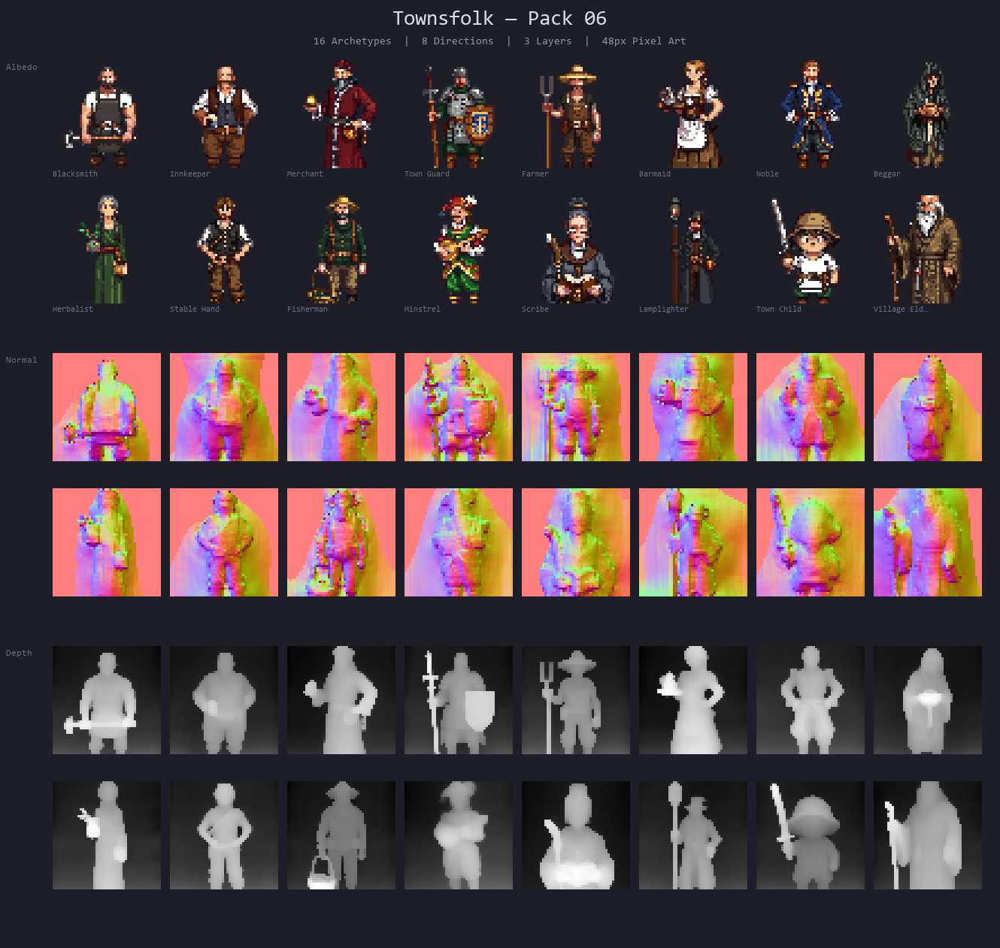
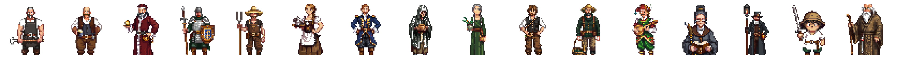

<p align="center">
  
</p>

<p align="center">
  <a href="https://www.npmjs.com/package/@sprite-foundry/townsfolk-48"></a>
  <a href="https://github.com/mcp-tool-shop-org/sprite-foundry-packs/blob/main/packages/townsfolk-48/LICENSE"></a>
</p>

A 48px, 8-direction pixel-art pack of medieval NPC townsfolk with albedo, normal, and depth maps for engine-agnostic game use. **Pack 06** in the [Sprite Foundry](https://github.com/mcp-tool-shop-org/sprite-foundry) catalog.



## What's Included

16 NPC archetypes across two tiers — **Town Core** and **Town Life** — each with 8 directional views:



### Town Core (v1.0)

| Variant | Role | Silhouette |
|---------|------|------------|
| Blacksmith | Weapon/armor shop | Burly build, leather apron, hammer on shoulder |
| Innkeeper | Rest/tavern hub | Stout frame, ale mug extended, keys on belt |
| Merchant | General goods trader | Fur-trimmed robe, balance scale, coin pouch |
| Town Guard | Town watch/authority | Chainmail, spear, round shield, open-face helmet |
| Farmer | Rural civilian | Straw hat, pitchfork, simple tunic, weathered stance |
| Barmaid | Tavern service/rumors | Braided hair, serving tray, tavern dress with apron |
| Noble | Wealthy quest-giver | Velvet doublet, jeweled chain, refined gloves |
| Beggar | Street info broker | Thin frame, ragged hood, wooden bowl, patched cloak |

### Town Life (v1.0)

| Variant | Role | Silhouette |
|---------|------|------------|
| Herbalist | Potion/remedy shop | Herb pouches, mortar and pestle, green shawl |
| Stable Hand | Mount/travel services | Hay in hair, rope coil, leather vest |
| Fisherman | Docks/waterfront NPC | Wide-brim hat, fishing rod over shoulder, waders |
| Minstrel | Entertainment/lore | Feathered cap, lute, colorful patchwork outfit |
| Scribe | Library/records | Spectacles, quill pen, leather-bound tome |
| Lamplighter | Night-shift atmosphere | Long pole with flame, lantern on belt, dark coat |
| Town Child | Town life flavor | Small frame, oversized cap, wooden toy sword |
| Village Elder | Village wisdom/quests | Long white beard, walking staff, heavy robes, hunched |

Each variant ships with three map layers:

- **Albedo** — base color sprites (transparent PNG)
- **Normal** — normal maps for dynamic lighting
- **Depth** — depth maps for parallax and elevation effects

## Install

```bash
npm install @sprite-foundry/townsfolk-48
```

## Folder Structure

```
assets/
  blacksmith/
    albedo/    8 directional PNGs (front, front_left, left, back_left, back, back_right, right, front_right)
    normal/    8 matching normal maps
    depth/     8 matching depth maps
    preview/   contact sheet
    manifest.json
  innkeeper/
  merchant/
  guard/
  farmer/
  barmaid/
  noble/
  beggar/
  herbalist/
  stable-hand/
  fisherman/
  minstrel/
  scribe/
  lamplighter/
  child/
  elder/
pack.json          pack-level index
previews/          banner and lineup sheets
```

## Manifest Format

Each variant has a `manifest.json`:

```json
{
  "slug": "blacksmith",
  "name": "Blacksmith",
  "version": "1.0.0",
  "tileSize": 48,
  "directions": ["front", "front_left", "left", "back_left", "back", "back_right", "right", "front_right"],
  "layers": {
    "albedo": "albedo/{direction}.png",
    "normal": "normal/{direction}.png",
    "depth": "depth/{direction}.png"
  },
  "preview": "preview/contact_sheet.png"
}
```

The pack-level `pack.json` indexes all variants with paths to each manifest.

## Engine Compatibility

These are plain PNG files with JSON metadata. They work with any engine or framework that can load images:

- Phaser
- PixiJS
- Godot
- RPG Maker
- Unity (2D)
- Custom engines

No engine-specific format or runtime dependency.

## Specs

- **Variants:** 16 NPC archetypes (8 Town Core + 8 Town Life)
- **Tile size:** 48 x 48 px
- **Directions:** 8 (front, front_left, left, back_left, back, back_right, right, front_right)
- **Total sprites:** 384 (16 × 8 × 3)
- **Format:** transparent PNG
- **Maps:** albedo + normal + depth
- **Animation:** static poses (v1)
- **Perspective:** top-down

## Extending the Pack

Want to generate additional townsfolk variants that match this pack's art style and export contract?

This pack was produced with [Sprite Foundry](https://github.com/mcp-tool-shop-org/sprite-foundry), an open-source ComfyUI + SDXL pixel-art generation pipeline. The foundry repo contains everything you need:

- **Generation pipeline** — `pipeline/foundry_gen.py` drives ComfyUI with per-subject configs
- **Subject configs** — `pipeline/chars/townsfolk_*.json` define the exact prompts, seeds, silhouette rules, and reject conditions for every variant in this pack
- **Batch manifest** — `pipeline/manifests/townsfolk_06.json` maps all 16 configs to the export structure
- **Export CLI** — `foundry export <run_id>` produces deterministic packs with checksums
- **ControlNet tuning** — humanoid depth strength 0.60, end% 0.85 (documented in the manifest)

To add a new variant:

1. Create a subject config in `pipeline/chars/` following the existing townsfolk configs
2. Register: `python -m foundry.cli subject-add <id> --name "Name"`
3. Generate: `python -m pipeline.foundry_gen --config pipeline/chars/<config>.json`
4. Review, accept, produce maps, accept finish, export
5. Copy the exported pack into the matching `assets/<slug>/` directory

The [Sprite Foundry README](https://github.com/mcp-tool-shop-org/sprite-foundry#readme) has the full pipeline walkthrough.

## Security

This package contains **only static PNG images and JSON metadata**. There is no executable code, no install hooks, no network access, and no telemetry. Assets are read-only by design.

See [SECURITY.md](SECURITY.md) for the full security policy.

## License

MIT — use in commercial and non-commercial projects.

## Credits

Generated with [Sprite Foundry](https://github.com/mcp-tool-shop-org/sprite-foundry) using ComfyUI + SDXL pixel-art pipeline.

Built by <a href="https://mcp-tool-shop.github.io/">MCP Tool Shop</a>
