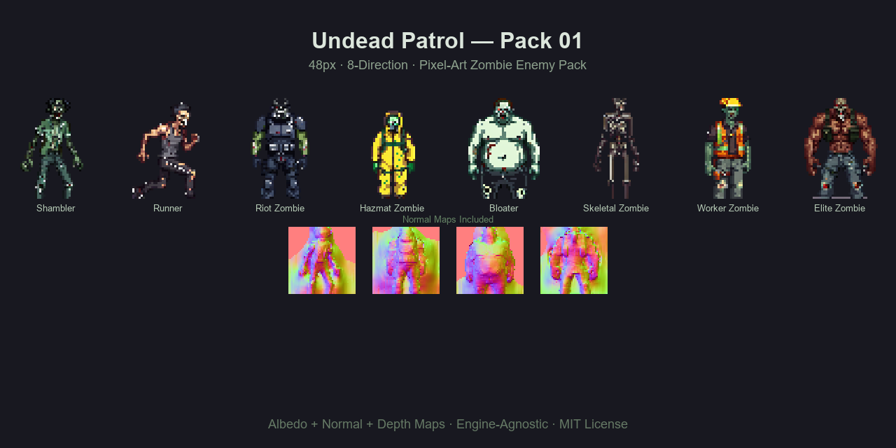
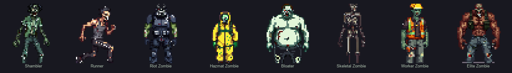

<p align="center">
  <a href="README.ja.md">日本語</a> | <a href="README.zh.md">中文</a> | <a href="README.md">English</a> | <a href="README.fr.md">Français</a> | <a href="README.hi.md">हिन्दी</a> | <a href="README.it.md">Italiano</a> | <a href="README.pt-BR.md">Português (BR)</a>
</p>

<p align="center">
  
</p>

<p align="center">
  <a href="https://github.com/mcp-tool-shop-org/zombie-sprite-pack/actions"></a>
  <a href="https://www.npmjs.com/package/@sprite-foundry/undead-patrol-48"></a>
  <a href="https://github.com/mcp-tool-shop-org/zombie-sprite-pack/blob/main/LICENSE"></a>
  <a href="https://mcp-tool-shop-org.github.io/zombie-sprite-pack/"></a>
</p>

Un paquete de enemigos zombis de arte de píxeles con 8 direcciones y 48px, que incluye mapas de albedo, normales y de profundidad para su uso en juegos independientes de la plataforma.



## ¿Qué incluye?

8 variantes de zombis, cada una con 8 vistas direccionales:



| Variante | Rol | Silueta |
|---------|------|------------|
| Arrastrador (Shambler) | No muerto básico | Postura encorvada, lenta y descompuesta |
| Corredor (Runner) | Amenaza rápida | Delgado, orientado hacia adelante, con un andar agresivo |
| Zombi Riot | Tanque blindado | Hombros anchos, volumen de escudo/armadura |
| Zombi Hazmat | Especialista contaminado | Forma de traje, perfil de capucha redondeada |
| Inflamado (Bloater) | Amenaza de área | Torso ancho, asimetría hinchada |
| Zombi Esquelético | Frágil/antiguo | Extremidades delgadas, aspecto anguloso |
| Zombi Trabajador | Industrial/civil | Uniforme, cinturón con herramientas, equipo reconocible |
| Zombi Élite | Comandante/bruto | Alto, imponente, masa mejorada |

Cada variante se entrega con tres capas de mapa:

- **Albedo:** sprites de color base (PNG transparente)
- **Normal:** mapas normales para iluminación dinámica
- **Profundidad:** mapas de profundidad para efectos de paralaje y elevación

## Instalación

```bash
npm install @sprite-foundry/undead-patrol-48
```

## Estructura de carpetas

```
assets/
  shambler/
    albedo/    8 directional PNGs (front, front_left, left, back_left, back, back_right, right, front_right)
    normal/    8 matching normal maps
    depth/     8 matching depth maps
    preview/   contact sheet
    manifest.json
  runner/
  riot-zombie/
  hazmat-zombie/
  bloater/
  skeletal-zombie/
  worker-zombie/
  elite-zombie/
pack.json          pack-level index
previews/          banner and lineup sheets
```

## Formato del manifiesto

Cada variante tiene un archivo `manifest.json`:

```json
{
  "slug": "shambler",
  "name": "Shambler",
  "version": "1.0.0",
  "tileSize": 48,
  "directions": ["front", "front_left", "left", "back_left", "back", "back_right", "right", "front_right"],
  "layers": {
    "albedo": "albedo/{direction}.png",
    "normal": "normal/{direction}.png",
    "depth": "depth/{direction}.png"
  },
  "preview": "preview/contact_sheet.png"
}
```

El archivo `pack.json` de nivel de paquete indexa todas las variantes con las rutas a cada manifiesto.

## Compatibilidad con motores

Estos son archivos PNG planos con metadatos JSON. Funcionan con cualquier motor o framework que pueda cargar imágenes:

- Phaser
- PixiJS
- Godot
- RPG Maker
- Unity (2D)
- Motores personalizados

No requiere formato específico del motor ni dependencia de tiempo de ejecución.

## Especificaciones

- **Tamaño de los mosaicos:** 48 x 48 px
- **Direcciones:** 8 (frente, frente_izquierda, izquierda, atrás_izquierda, atrás, atrás_derecha, derecha, frente_derecha)
- **Formato:** PNG transparente
- **Mapas:** albedo + normal + profundidad
- **Animación:** poses estáticas (v1)
- **Perspectiva:** vista superior

## Extender el paquete

¿Quieres generar variantes de zombis adicionales que coincidan con el estilo artístico y el contrato de exportación de este paquete?

Este paquete se creó con [Sprite Foundry](https://github.com/mcp-tool-shop-org/sprite-foundry), una canalización de generación de arte de píxeles de código abierto ComfyUI + SDXL. El repositorio de Foundry contiene todo lo que necesitas:

- **Canalización de generación:** `pipeline/foundry_gen.py` controla ComfyUI con configuraciones específicas para cada sujeto.
- **Configuraciones de sujetos:** `pipeline/chars/zombie_*.json` definen las indicaciones exactas, las semillas, las reglas de silueta y las condiciones de rechazo para cada variante de este paquete.
- **Manifiesto por lotes:** `pipeline/manifests/undead_patrol_01.json` mapea las 8 configuraciones a la estructura de exportación.
- **CLI de exportación:** `foundry export <run_id>` produce paquetes deterministas con sumas de comprobación.
- **Ajuste de ControlNet:** fuerza de profundidad humanoide 0.60, end% 0.85 (documentado en el manifiesto).

Para agregar una nueva variante:

1. Crea una configuración de sujeto en `pipeline/chars/` siguiendo las configuraciones de zombi existentes.
2. Registra: `python -m foundry.cli subject-add <id> --name "Nombre"`
3. Genera: `python -m pipeline.foundry_gen --config pipeline/chars/<config>.json`
4. Revisa, acepta, genera mapas, acepta finalizar, exporta.
5. Copia el paquete exportado en el directorio correspondiente `assets/<slug>/`.

El [README de Sprite Foundry](https://github.com/mcp-tool-shop-org/sprite-foundry#readme) tiene la guía completa de la canalización.

## Seguridad

Este paquete contiene **únicamente imágenes PNG estáticas y metadatos JSON**. No incluye código ejecutable, ni mecanismos de instalación, ni acceso a la red, ni telemetría. Los recursos son de solo lectura por diseño.

Consulte el archivo [SECURITY.md](SECURITY.md) para conocer la política de seguridad completa.

## Licencia

MIT: se puede utilizar en proyectos comerciales y no comerciales.

## Créditos

Generado con [Sprite Foundry](https://github.com/mcp-tool-shop-org/sprite-foundry) utilizando el pipeline de arte de píxeles ComfyUI + SDXL.

Desarrollado por <a href="https://mcp-tool-shop.github.io/">MCP Tool Shop</a>
